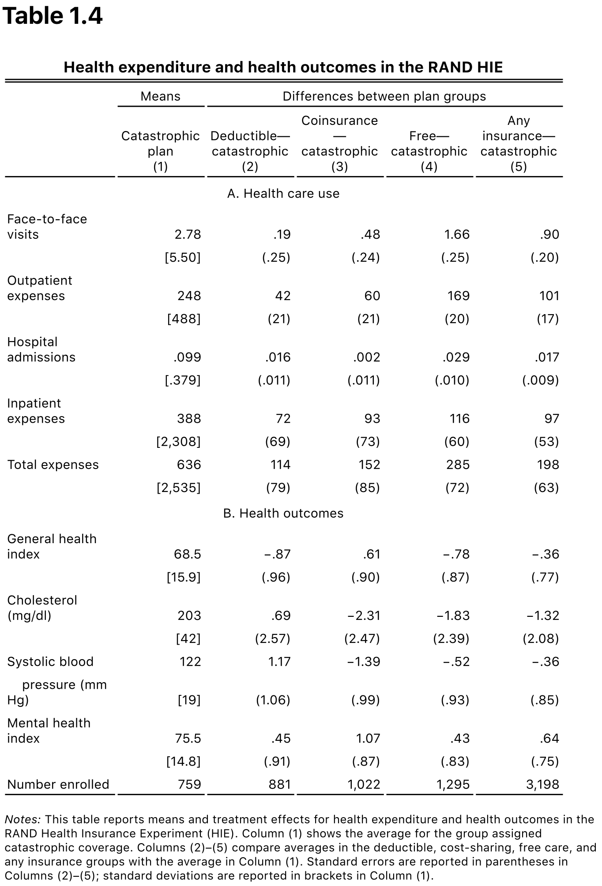

```{r setup, echo=FALSE, message=FALSE, include=FALSE}
library(tidyverse)
library(ggplot2)
library(patchwork)
library(data.table)

options(htmltools.dir.version = FALSE)
knitr::opts_chunk$set(echo = TRUE, dpi = 300, fig.height = 3)


theme_set(theme_minimal())
```

# Main Topics This Week

- Checking randomization with covariates
- Review of multivariate regression
  - How to interpret regression results, using example data on public versus private colleges.
  - Discrete regressors (categorical data, dummy variables)
  - Continuous regressors (can summarize average effects of continuous treatment)
  - Model specification: linear models
  - Interpreting results with logarithms
  - Saturated models and model flexibility
- Tennessee STAR experiment: effects of class size in kindergarten.
- Controlling for covariates can increase statistical precision in experiments.
- Omitted-variable bias in observational data.

---

# An Example of Covariates
## Example: Health insurance
- Observational dataset called the National Health Information Survey (NHIS). 
- Variables: 
  - *Treatment*: having health insurance
  - *Outcome*: Overall health index (rated 1-5 on a survey)
  - *Covariates*: All the characteristics listed in panel B of Table 1.1.

## Reading: Chapter 1 of *Mastering Metrics*, pages 1 through top of 6.

---
class: inverse, center, middle
# Covariate Balance 

---
# Covariate Balance
## Covariates can show us when we fail to have an apples-to-apples comparison.

- Insured individuals have different values of covariates than the uninsured; 
  - Different on concepts from education to family size to income.  
- Table 1.1 on page 5 of MM: 
  - Striking difference on *family income* 
  - Insured husbands have $60,000 more family income than uninsured husbands
  - Highly statistically significant 
- Difference between the insured and uninsured groups is not only economically large (practically significant), but also statistically significant: **More than 40 standard errors**!

## This is not an apples to apples comparison 
- Income could easily improve someone's health as much as insurance status does

---
# Example with actual randomization

- Observational choice to buy health-insurance fails a covariate balance check.  
- Surprising? Not really. 
- What if health insurance were actually randomly assigned? 

## Optional reading: *Mastering Metrics* pages 6-16  
- Reviews potential-outcomes notation in a health-insurance example, 
- Reviews the concept of as well as a review of the concept of expectation.  
- Feel free to read these first if you think the review would be helpful, but...

## Mandatory Reading: *Mastering Metrics* pages 16-22
- Start reading with the second paragraph of page 16 of MM, and read through the first paragraph of page 22.

---
class: inverse, center, middle
# Covariate Balance as a Randomization Check

---
# Rand Health Insurance Experiment
## Table 1.3 of Mastering Metrics
- Covariates for the RAND Health Insurance Experiment (HIE).
- Column 1: Means for those who received the minimum health coverage (catastrophic insurance).
- Columns 2-5: Differences between those who got catastrophic insurance and those who got a higher level of coverage.
- Income is the largest effect, but statistically insignificant. 
- All of the covariates show insignificant differences between treatment groups.

---
# Rand Health Insurance Experiment

[scale=75%]

---
# Rand Health Insurance Experiment


---
# Very Good Covariates 
## Previous values of the outcome variable are particularly valuable covariates.

- Table 1.3, panel (b)
- Almost all of the differences between treatment groups not statistically significant
- However, notice Column 2, of the blood-pressure: Difference that is (just barely) larger than two standard errors.  
- Is this a problem? Well, probably not.  
- One in twenty tests will reject the null hypothesis. 
- When we see one out of thirty-three, this doesn't raise immediate concerns.

---
# Lesson for Experiment Design

## HIE: Small treament groups, many treatments
- HIE was complicated with many small treatment groups, spread over more than a dozen insurance plans.  
- With only 4,000 subjects, it isn't possible to get precise measurements for any insurance plan.  Wide confidence intervals, and low power. 

## Fix it in post? Try not to.   
- It **is** possible to fix an experiment where you spread your observations to thin. 
  - Researchers pool together a number of treatments into four broad categories of health insurance plans: (1) catastrophic, (2) deductible, (3) coinsurance, and (4) free.
  - Pooling raises questions if pooling happens after the fact. 

## Low power? 
- Consider fewer experimental treatments, or pre-specify a plan that pools conditions. 

---

# Example: Health-Insurance in Oregon

- *Natural Experiment* on health insurance in Oregon. 
- State  had limited budget available to expand health insurance for the poor
- For fairness, allocated the scarce good using a lottery
- This is found-experiment **gold**! 

## Read MM, pages 22 to the top of page 30.
- How would you summarize the results of the two studies? 
- Can there be two answers that are both correct? Or, must one produce an incorrect estimate? 

---
class: inverse, center, middle
# Results from Health-Insurance Experiments

---
# Results from HIE

1. Increasing coverage causes increased spending on health care.  (*Downward-sloping demand!*)
2. **Physical Health**: Increasing coverage does not produce large improvements in physical health.
3. **Mental Health**: Increasing coverage *does* increase in mental health and financial status.
4. **Emergency Services**: No evidence of increased preventative-care or decreased emergency department utilization

---
# Results from HIE 


---
# Results from HIE 


---
# Results from HIE


---
# Looking forward: Noncompliance 

## Did people offered insurance always take it? 
- 25% of the sample of lottery winners actually obtained insurance.  
- Individuals could enter the lottery, and then if they won, evaluate whether it was *worth* it. 

## Treatment concompliance
- not everyone the experiment intended to treat actually received the treatment
- The effects of the Oregon insurance are four-times larger for each person who actually received insurance, than the "intent to treat" estimates given in Tables 1.5 and 1.6
- In a future unit, we will cover this concept in detail

---
# Reading: FE, Covariate Balance 

## Read *Field Experiments*, Section 4.3 
- Joint test for significance of covariates using an F-test
  - Consider *Mastering Metrics*  Table 1.3.  
  - 11 different covariates 
  - Individual t-tests for each covariate $\rightarrow$ false-discovery problem? 
- T-tests are often sufficient, but if covariates are correlated, t-tests could fail to reject *when they should*. 
- *Field Experiments* proposed method: 
  - Regress the binary treatment variable (0 for catastrophic, 1 for deductible) on the whole list of 11 covariates 
  - Interpret the regression F statistic to test the hypothesis that all 11 differences are jointly equal to zero.

---

class: inverse, center, middle
# Example Where the Randomization Check Fails

---

# Example: Covariate Imbalance 

## Lewis and Reiley: Advertising at Yahoo! 
- As discussed in Week 2, we had a third-party data firm who matched up the individual Yahoo! advertising data with the retailer's sales data, using name and address information in both databases, then de-identified each observation before sending it to us for analysis.
- Over 100 columns of data:
  - Number of ad views each week
  - Online and offline purchases each week, with 52 weeks of history.

## Problem
- When we got back the data and did a quick calculation of the treatment effect, we found that the control group was purchasing significantly less than the treatment group.  
- Strange? Yes. Unexpected? Yes? 

---

# Shoe Leather: Checking Covariates 

## Checking covariates identifies what went wrong
- Our most important covariate: pre-treatment purchases.
- Treatment group started a gradual decline in sales relative to the control group, weeks before the experiment began.  But if randomization worked correctly, we should have had pre-treatment purchases identical between the two groups.  We clearly had a problem.
- **One Clue**: Lower sales for those who actually received ads in the treatment group (versus those untreated).
- **Another Clue**: Online sales were much lower than expected in both treatment and control groups, and almost exactly zero in the treatment group.
- Eventually, we realized that the data-matching firm had a buffer-overflow problem that they never noticed.
- Great example of an administrative error detected with careful attention to the covariates in the data.

---

# Reading: History of Experiments and Randomization 

## Read Mastering Metrics, pages 30-33
- Next, we'll read a brief history of experiments in the social sciences.

---
class: inverse, center, middle
# History of Experiments and Randomization

---
# Milestones in experimentation

- **Religious prophet Daniel**: Proposed an experiment on a vegetarian diet.
- **James Lind (1742)**: Experimented with citrus in the diet and demonstrated that it cured scurvy.  
  - (Note that while he didn't randomize, he chose his 12 subjects with covariate balance in mind.)
- **Charles Peirce (1885)**: First recorded use of random assignment.
- **Sir Ronald Fisher (1935)**: Detailed theory of randomized experiments.
- **Galileo (1500s)**: Because of their focus on social science, Angrist and Pischke are missing one key historical reference on experimentation! 

---
# Optional statistics review

- Depending on how solid you feel your statistics background to be, you may also optionally wish to review the Appendix of Chapter 1
  - Sample means and being correct on average
  - Variance, standard deviation, and standard error
  - How far off can the sample mean be? (CLT)
  - Comparing two means
  - t-statistics and confidence intervals

---
# More uses! 
## Checking for covariate balance is just one use of covariates.
- When treatment and control have slightly different covariate values, we may wish to control for these covariates.  (We do so using regression!)

## Reading: MM 47-55
- Please read MM Chapter 2, pages 47-55 on the concept of matching.

---
class: inverse, center, middle
# Matching 

---
# Matching Observations

## Matching observations as regression motivation

- Do (more expensive) private colleges **cause** their alumni to earn more income than those alumni would earn if they had attended to public universities? 

## Selection Bias
- People who go to Harvard might other advantages and privileges apart from their university education. 
- Perhaps these other features mean these students would end up with higher incomes on average even, if they had gone to public universities.

## One proposal 
- Compare students who are accepted to exactly the same set of colleges
- One matriculates private while another matriculates public.

---
# MM Table 2.1

---

# MM: Table 2.1

## Table 2.1:  
- Example data for 9 students in 4 different groups.
- Each group has identical application and acceptance decisions.
- Gray boxes show which college each student decides to matriculate to.
- We get reasonable comparisons from group A and from group B.   
- Groups C and D do not give us any useful data, because we can't find both public and private matriculations within either group.

- **Group A**: Estimated value of private college is -$5,000.
- **Group B**: Estimated value of private college is +$30,000.
- **Weighted average**: +$9,000.

---
# Danger of Selection Bias! 


---
# Danger of Selection Bias!

- A naive comparison between the mean for people who attend private colleges with the mean for those who attend public colleges, we get a **much** larger answer: 
  - Mean difference is $20,000.
- Comparing group A to group B: 
  - Students who apply to more private schools tend to earn higher incomes.  
  - Differences don't depend only on where you attended, 
  - Types of people who choose to submit more applications to private schools earn more, regardless of where they attend. 


## Question 
- Why use both application and acceptance?  
- **Answer**: A person who apply to lots of selective schools but only got into one may be less talented than the average person admitted to the selective school.

---
# Limitations of Observational Matching 
## When does the observational matching strategy fail?
- The matching strategy intends to compare apples to apples by matching students who have identical application and acceptance decisions.  
- But since this is an observational strategy rather than an experiment, we know it's still possible to get the wrong answer even with this matching.  
- Can you think of a story under which the results of the matching exercise are still plagued by selection bias?

---
# Limitations of Observational Matching
## David's Story 
- Two people who get in to the same pair of schools
  - **Alice** chooses the private school
  - **Bob** chooses the public school.  
- Different interests $\rightarrow$ selection effects.  
  - We would overestimate the benefit of switching someone from a public to a private school
  - People who choose to go to private school benefit from it more than the people who choose public schools.

---
# Regression: An elegant estimator 
- Pure matching requires a match from the untreated group for each member of the treated group.
- Regression summarizes this effort by specifying a single equation simultaneously containing both the treatment variable and the covariates we care about accounting for.

## Reading: Mastering Metrics, Section 2.2 55 - 59

- Pointers 
  - Equation 2.1 applies to the simulated data in Table 2.1.  
  - $P_{i}$ is a dummy variable equal to 1 if the student attended a private school and 0 if the student attended a public school.
  - $A_{i}$ is a dummy variable equal to `1` if the individual is in group `A`, and `0` if the individual is in group `B`.  
  - Remember that we have to drop from our analysis any individuals in groups `C` and `D`, because we don't get any public-private comparisons out of those groups. 

---
class: inverse, center, middle
# Our First Regression Example

---
# Regression

## Demystifying Regression 
- Regression can sound scary to some people. But let's demystify it.  
- Understanding regression results really only requires simple arithmetic!
- If needed, you might want to review the material on regression from your MIDS course *Statistics for Data Science*

---
# MM: Equation 2.1 
## *Mastering Metrics* Equation 2.1

$$Y_{i} = \alpha + \beta P_{i} + \gamma A_{i} + e_{i}$$

- Multivariate: 
  - $P_{i}$ is treatment
  - $A_{i}$ is covariate for how many applications
  - Both are dummy variables.

## Interpreting Coefficients
- $\beta$:  average change in $Y$ for a unit change in $P$
  - Changing from $P_{i} =0$ to $P_{i} =1$. 
- Adding $A_{i}$ to the regression allows the mean income to be different (regardless of their schooling choice) 
- (Might) help  correct selection bias, because students in each group may earn different incomes for reasons other than their school being private versus public.  
- Including this covariate in the regression accomplishes a matching function just like we saw earlier, but now in the regression context.

---
# Continue Reading: Mastering Metrics

## Reading: Mastering Metrics, 59-64 
- Read MM from page 59 to the bottom of page 64, to see our second example of a regression.

## Pointers 
- Equation 2.2 is a generalized version of Equation 2.1. 
- Instead of just one group dummy variable, now 150 estimated parameters.  
- Also includes more covariates, like SAT score and parental income.  
- Results of estimating regression Equation 2.2 are reported in Table 2.2, column 6.  Each row gives a different coefficient.
- Table 2.2 shows results for six different regression specifications. 
  - Each column represents a different estimated regression equation
  - Columns 2 and 3, for example, representing longer equations with more variables
- Columns 1-5 of Table 2.2 contain the results for estimating shortened versions of Equation 2.2.  
  - The heading "without selection controls" means that the `GROUP` dummy variables have been omitted from the regression.

---
class: inverse, center, middle
# Our Second Example of Regression 
---
# Reading Regression Results
## Goals of understanding
- What is the difference between column 1 and column 2?
- Which value in each column represents the estimated treatment effect?
- What do the numbers in standard errors mean?
- What is the difference between column 2 and column 3?
- What is the difference between column 1 and column 4?  What are the selectivity group dummies?

---
# Reading Regression Results (cont'd) 
- In our first regression example, we had just two regressors, both of them discrete. 
  - This time we have some continuous regressors as well.  
  - Which of the covariates are continuous?
  - (Own SAT score, parental income)
  
## Questions   
1.  What does it accomplish to have the left-hand side be `log(earnings)` rather than just `earnings`?
2. What does it mean that the treatment effect changes as we move from column 1 to column 3, but does not change much as we move from column 4 to column 6?

---
# Example: Tennessee STAR Experiment 
- Next we're going to look at the example of the Tennessee STAR experiment on class size in kindergarten.
- This supplemental reading comes from Chapter 2 of Angrist and Pischke's previous book, *Mostly Harmless Econometrics*. 
  - A copy of this reading is in the course repo, linked [here](https://github.com/UC-Berkeley-I-School/mids-w241/blob/main/readings/MHE_chapter_2.pdf) 

## Reading: *Mostly Harmless Econometrics* pages 16-24   
- *Note*: The last two paragraphs of page 21 discuss a technique called "regression discontinuity". We will discuss this later in the week on observational data.
- Pay particular attention to making sure you can read the regression results in Table 2.2.2.

---
class: inverse, center, middle
# Tenessee STAR: Regression with Experimental Data

---
# The Tennessee STAR Experiment

## Strategy for Summarising
- What is the outcome variable?
- What are the treatment variables?
- What are the covariates?
- The main treatment effect is in the first row. 
  - How do we interpret the number `4.82`? 
  - Is it statistically significant?
- How should we interpret the coefficient of `0.12`? Is it statistically significant?

## Strategy for Reading Tables
- What is the difference between column 1 and column 2?
- What is the difference between column 2 and column 3?
- What is the difference between column 3 and column 4?

---
# The Tennessee STAR Experiment
- Note that the treatment effect does change a bit, from `4.82` to `5.37`, when we add school fixed effects to the regression.  Why?
- Randomization happened within each school, not necessarily consistently across schools.
  - For example, urban schools might have had 1/4 Small classes while rural schools had 1/2 Small.
  - If treatment group disproportionately contains rural schools, with lower test scores, this gives us downward bias in the ATE.
- Fixed effects let us estimate the effect within each school, then pool across schools. (Same as with our "selectivity groups" in the private-school example.)
This also reduces noise in the outcome due to school-level factors (similar to blocking!)

---
# The Tennessee STAR Experiment

- Why does the R-squared increase when we increase the number of covariates in the regression specification?
- When we move across the columns, the estimated coefficient for class size doesn't change much. 
  - This contrasts with what we saw in the public-versus-private school data in your textbook as we added more variables. 
  - What's the difference?
- When we move across the columns, the standard error on the treatment effect gets smaller.  Why?
- FE, Section 4.1 (Difference in differences) and Section 4.2 (Covariates in regression) will give us more discussion of this last point. 

---
class: inverse, center, middle
# Difference in Differences reading

---
# Difference in Differences

## Reading: Field Experiments, Section 4.1 
- Difference in Differences is a special case of regression with covariates
- "Rescaling" might be confusing; can think in terms of differences

---
class: inverse, center, middle
# Difference in Differences

---
# Difference in Differences
- Difference-in-differences redefines the outcome variable to be a before-vs-after change.
  - Instead of the original $Y$, we use the change in $Y$.
    - DID is very similar to inserting the past (lagged) value of the outcome into the regression as a covariate.
- What's the main difference between lagged-dependent-variable covariate and DID?

## Why might we do this?
  - Example: Lewis and Reiley (2014), sections 3.3-3.4.
  - We get additional power.  Similar to the case of blocking.

## Reading: *Field Experiments* Section 4.2 
- *Field Experiments* Section 4.2 reinforces what we already learned from the example of the Tennessee STAR experiment.

---
class: inverse, center, middle
# Summary of Using Regression with Experiments

---
# Regression Key Points 
## Two key points to review about regression with experiments.
1. With randomized treatment assignment, we know that treatment is uncorrelated with everything else: both observable covariates and unobservables we can't measure.  
  - In an experiment, we don't have to worry about omitted-variable bias, because we should get approximately the same answer no matter how many covariates we include.
2. What including covariates does for us in an experiment is explain some of the residual variance in the regression, allowing us to shrink the standard error on the treatment effect.  
  - You can see this in Table 2.2.2 from the supplemental reading on the Tennessee STAR experiment.

---
# Reading About Private Schools 
## Reading, *Mastering Metrics*, bottom of p. 64 to middle of 68.  
- Return to MM for some additional reading on the private-school question.  
   - Remember this is observational data
   - We're going to use this to illustrate the concept of omitted variable bias.  
- The previous matching analysis was only able to consider 5,600 out of 14,000 student observations
   - The matching method drops all the observations that didn't have exact matches where another student had the same acceptances but matriculated differently.  
  - This reading looks at a way to make use of all 14,000 observations. 
  
---
class: inverse, center, middle
#Omitted-Variable Bias: Example

---
# Returns to Schooling 
- In this observational analysis of the earnings benefits of private colleges, we simplify the model in order to be able to look at a larger sample size.
- Previously, we included only those 5,600 observations for whom we could measure effects within a matching selectivity group.
- Now we replace the 150 selectivity group dummies with just four variables:
  - Average SAT score of schools applied to
  - Sent two applications
  - Sent three applications
  - Sent four or more applications (Omitted category: sent a single application)
- This is one continuous variable and three discrete variables.  (Note that we have effectively transformed number of applications from a continuous variable into three binary variables.)

---
# Reading Regression Results 
## Let's get a little more practice reading regression results.

- In the last row of column (4), we see the coefficient 0.139.  This means that people who submit at least four college applications end up earning about 13.9% more income than otherwise identical people who submit only a single college application.
- Having `log(earnings)` as the dependent variable allows us to interpret the difference as a percentage of earnings ($Y$).  
- Note that with continuous variables, sometimes we might choose to take the log both of the $Y$ variable and the $X$ variable before regressing.  
  - That coefficient would be interpreted as an elasticity: 
  - How many percent change in $Y$ do we see as $X$ increases by 1%?
- Notice that we are measuring the difference between "four or more applications" and those in the default (omitted) category.  The default group submitted only a single college application.

---
# Observational Data: Omitted Variables
## In observational data, we always have the potential for omitted-variable bias.
- Note the direction of bias when we omit the "own SAT score" variable.  
  - Overestimate the effect in column 1, because SAT score is positively correlated both with earnings and with those who go to private school. 
  - The coefficient shrinks as we move to columns 2 and 3 and 4, with more covariates.
- If we had randomized private school assignment, we would have had private school uncorrelated with SAT, so the coefficient would not have changed much.
- Takeaway is that the correlation between earnings and private school is spurious:  **the causal effect appears to be approximately zero.**

---
# Fixing Bias? 
## OVB is mitigated by controlling for college selectivity
- The treatment coefficient doesn't change much as we move across columns 4-6.  
  - *The treatment coefficient "stabilizes."*  
- The authors take this as evidence that with the four selectivity control variables, we are approaching the good causal inference of an experiment.  
  - However, even here, we could have an OVB problem.
  - Suppose that choosing a private school is more likely to be done by people who predict they will especially benefit from private school.  
  - We can't measure this unobserved tendency to benefit from private school, but it could **always** be lurking there.

---
# Reading: Proof of Omitted Variables Bias 
## Reading: *Mastering Metrics*, section 2.3, 68-78
- Theory and math behind omitted-variable bias.

## Reading Tips
- By "short" the authors refer to a regression with a short list of regressors.  
- By "long" they denote a regression with a longer list of regressors, including previously omitted ones.
- What you'll see in Table 2.5 are results for what's indicated in the equations by the phrase "regression of omitted on included."  
- What we're doing here is taking Table 2.3 as a starting point.  There we see what happens when we omit the variables "own SAT score" and "log(parental income)" 
- OVB makes us overestimate the true effect of private college.   Now what we do in Table 2.5 is regress these omitted variables on the other included variables in the regression, to see how they are correlated.

---
class: inverse, center, middle
# Omitted-Variable Bias: Theory

---
# Direction of Bias 
## Goal: Remember intuition about the direction of bias

- Suppose $Y$ is a function of both $X_{1}$ and $X_{2}$:

$$Y = \alpha + \beta_{1}X_{1} + \beta_{2}X_{2} + \epsilon_{long}$$ 

- But, instead of this long regression, we instead omit X2 and run the short regression:

$$Y = \alpha + \beta_{1}X_{1} + \epsilon_{short}$$ 

- When we do this, any effects of $X_{2}$ can influence $Y$ only through $X_{1}$ in the equation.
- Suppose we regress earnings on years of education, and we omit `IQ`.  
  - Suppose people with higher IQ are likely to get more school.  
  - Then, model would overestimate the effects of schooling in our short regression, 
  
---
# Features of OVB
## The direction and magnitude of the bias depend on two things:

1. How correlated is $X_{2}$ with $Y$?  
  - *If the omitted variable has no effect of its own, there's no bias.*
2. How correlated is $X_{2}$ with $X_{1}$?  
  - *If the omitted variable is not correlated with the included variable, then there's no bias.* 

---
# Features of OVB
## Bias of IQ?
- **Overestimation bias** for earnings when IQ is omitted 
  - Both correlations are positive, and the amount of bias is  positive.  
- **Underestimation bias.** 
  - Consider the omitted variable of rock-music talent.  
  - Assume talent is positively correlated with earnings and negatively correlated with years of school
  - (Great rock musicians may choose to skip college and start a band out of high school) 

## Sure about no bias? 
- We can never be sure we've gotten rid of all omitted-variable bias in observational data.  
- In experimental data, we can guarantee that the treatment $X_{1}$ is uncorrelated with everything else. **Eliminates  omitted-variable bias!**

---
# Reasoning About OVB 
## When faced with observational data, ask these questions: 
1. What would be the ideal experiment for measuring the causal effect we're interested in?
2. Where does the variation in the observational data come from?  In other words, whom are you comparing to whom?
3. Can we tell stories about why the regression estimate might be biased, and what might be the direction of the bias? In particular, why did people end up in the groups you are comparing in the first place? And why might they differ for other reasons?

---
# Reading: History of regression
## Reading: *Mastering Metrics* pages 78-81
- This completes the reading from the main text of Chapter 2.  
- Introduces the pioneers of regression: **Francis Galton** and **George Yule**.

---
class: inverse, center, middle
# History of Regression

---
# History of Regression 
- Regression was developed in the late 1800s by Galton and Yule.  
- *Note that the calculations were much harder in the absence of computers!*

## Francis Galton
  - Galton's first linear model (1886) showed "regression to the mean" when he regressed sons' heights on their fathers' heights -- the term *regression* was born. 
  - The slope was less than 1, indicating that each person's height is, on average, intermediate between his father's height and the mean height.  
  - The term "regression" has now come to mean least-squares fitting of a model. 
- Galton's regression had only one variable on the right-hand side.

## George Yule
- Yule developed multiple regression (1899), with more than one variable on the right-hand side. His application was whether various English anti-poverty programs increased or decreased the number of people in poverty.

---
# Reading: Reading Theory of regression
## Reading: *Mastering Metrics* Appendix to Chapter 2
- Right now, read pages 78-85 (these are the correct page numbers)
- You can optionally read pages 86-94, if you are interested, on the theory of:
  - Covariance
  - Residuals
  - Dummy Variables
  - Derivation of the OVB bias formula
  - Interpretation of logarithmic models

---
class: inverse, center, middle
# The Conditional Expectation Function

---
# The Conditional Expectation Function
## In general, models don't have to be linear.

- In Figure 2.1 of MM, we see the relationship between earnings and years of schooling in observational data.  
- You can see that it's slightly nonlinear.  (Reproduce figure here)
Linear regression of `log(earnings)` on years of schooling gives us the best linear approximation to this curve.
To measure the curve in full generality, we would need to use a "saturated" model, where instead of including "years of schooling" as a linear regressor on the right side, we'd instead use a full set of dummy variables, one for every possible number of years of schooling between 0 and 20.

---
# Reading: Saturated Models  
## Reading: *Mostly Harmless Econometrics* section 3.1.4, pages 48-51. 
- Read an excerpt from Angrist and Pischke's other book, Mostly Harmless Econometrics, which we've made available for you here. 

---
class: inverse, center, middle
# Regression Specification 
## What goes on the right-hand side of a regression equation?

---
# Choosing Covariates 
## Two Major Questions: 
1. How do we choose the covariates? 
2. How do we choose the *functional form* of a regression? 

---
# Choosing Covariates 
## What is a saturated model?
- Each value of the covariate gets a different dummy variable to represent it.
- With multiple covariates, we also have to include all possible interactions between these dummy variables (to estimate a 2- or 3-dimensional surface)

## Why choose a model that is not fully saturated?
- Linear in a continuous variable (not a full set of dummies)
- Exclude interaction effects
- (Answer: worry about too little data per cell to get identification and precision.  If you only have 500 observations, you can't estimate a full 10x10x10 model.  But you could try a coarser model.)

---
# Choosing Covariates
## What is good about using lots of covariates?
- Increased statistical precision
## What is bad about using lots of covariates?
- "Fishing expeditions" happen quite frequently with observational data. 
- Not much downside in an experiment, if we have made sure that  X is independent of all covariates.

---
class: inverse, center, middle
# Lessons to remember

---
# Lessons to Remember
## What we want you to remember from this week:	
- Checking for covariate balance can help us identify execution problems in experiments.
- A multivariate regression can contain both discrete and continuous regressors.
- Most observational data is studied using multivariate regression. Because it's observational, we can never be sure the coefficients give us true causal effects.
- Omitted variable bias. Learn to tell stories about the expected direction of bias.
- Experiments give us independence between treatment and potential outcomes, so we don't have to worry about OVB.  So why use regression to analyze experiments? 
- Increased statistical power. Measuring and including covariates can help us gain precision of our experimental treatment estimates. Covariates soak up residual variance, and shrink standard errors on the treatment effect.

