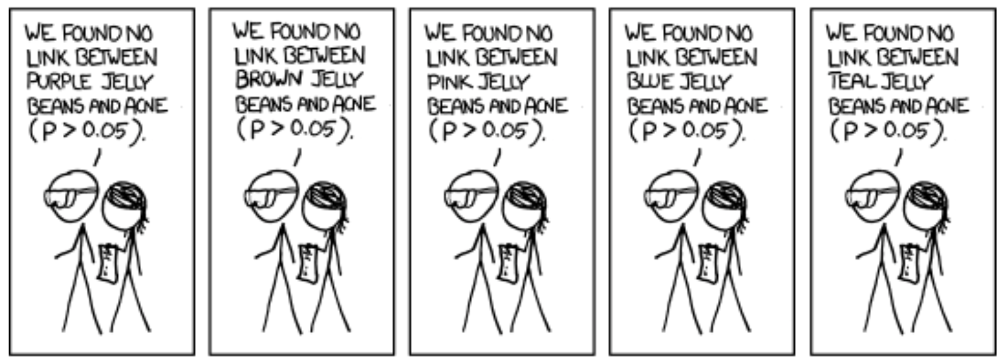
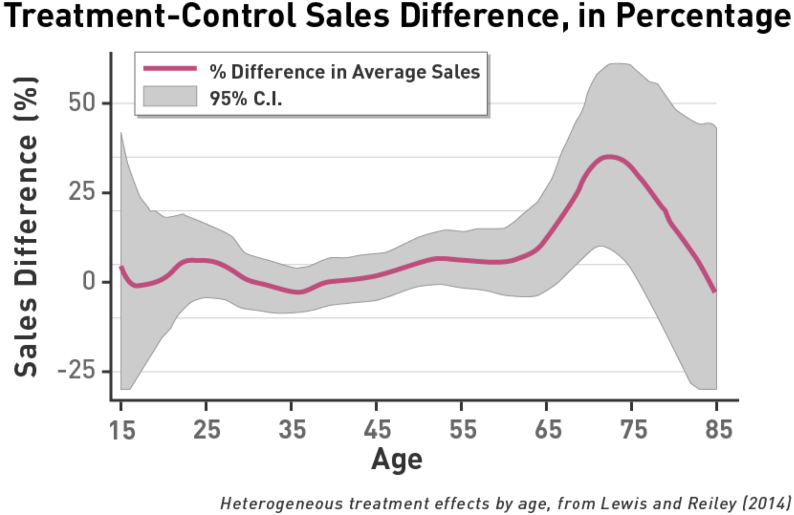

```{r setup, echo=FALSE, message=FALSE, include=FALSE}
library(latex2exp)
library(tidyverse)
library(ggplot2)
library(patchwork)
library(data.table)

berkeley_blue   <- '#003262'
california_gold <- '#FDB515'

options(htmltools.dir.version = FALSE)
knitr::opts_chunk$set(echo = TRUE, dpi = 300, fig.height = 3)


theme_set(theme_minimal())
```

class: inverse, center, middle 

# Introduction to Heterogeneous Treatment Effects 

---

# Main Topics 

## Heterogeneous treatment effects
- Does the same same treatment have different effects on different subjects? 
- Use of regression to measure HTEs: Interaction between covariates of interest and treatment variable 

## Data analysis with non-experimental control
- Multiple comparisons problem: Fishing expeditions can cause overstatement of true statistical significance.

---

# Reading 

## Reading: *Field Experiments* 
Please read

- Section 9.0 (the Introduction), and, 
- Section 9.1 

---

class: inverse, center, middle 

# Motivating Examples of Heterogeneous Treatment Effects 

---

# Quiz Question Discussion

- Potential outcomes are hypothetical population parameters.
- In real-world samples, we get to measure only
  - Treatment outcomes for the treatment group
  - Control outcomes for the control group
- We can measure only treatment outcomes or control outcomes for a single person.

---

# Reading 

## Reading: *Field Experiments*, Section 9.3.1

While reading, consider, "Do different groups have different treatment effects?"

---

# Example: Electricity Consumption

## Test Groups
1. Below-average; and, 
2. Above-average electricity consumers

## Treatment 
- Social comparison
- How much electricity are your neighbors using? 

## HTE
- Are people who use a *lot* of energy more responsive than people who aren't using much energy? 
- Are people who are using less than their neighbors going to start using more? 

---

# Example: Congressional Responsiveness

## Test groups
1. Members of Congress from the North; and, 
2. Members of Congress from the South

## Treatment 
- Being informed of a meeting with a donor versus a constituent

## HTE
- Responsiveness of different congressmen

---

# Example: eBay Shipping Policies 

## Test groups 
- Buyers of high-priced items 
- Buyers of low-priced items

## Treatment
- Charging (or not charging) a shipping price on an auction
Some measure of value should be predetermined before the experiment

## HTE
- Responsiveness to shipping costs on high-value versus low-value items

---

# Example: eBay Seller Reputation

## Test Groups 
- Buyers of high-priced items 
- Buyers of low-priced items

## Treatment 
- Selling from a high- or low-reputation account 

## HTE
- Are people differently reactive to reputation when they are buying high-priced, rather than low-priced items? 

---

# Example: Donation Matching 

## Test Groups 
- People who live in *Blue States* 
- People who live in *Red States* 

## Treatment 
- Informing individuals that a donation they make to the ACLU will be matched 

## HTE 
- Because the ACLU is perceived to be a "Liberal" non-profit organization, do individuals who live in areas that are more liberal react more strongly to the donor-matching treatment? 

---

class: inverse, center, middle 

# Treatment-by-Covariate Interactions 

---

# Quiz Review 

## Answer
- Students whose parents' literacy was above the median

## Discussion 
- Treatment effect not statistically significantly different between students whose parents have above-median versus below-median literacy
- We need to know standard errors in order to evaluate how much to believe a point estimate

---

# Estimating HTEs

## Etimating with two samples 

- Split data into two separate samples
- Compute means and standard errors of the treatment effect in each group
  - Do a two-sample test of means.
  - **Group one**: Students whose parents have above-median literacy
  - **Group two**: Students whose parents have below-median literacy
  
---

# Estimating HTEs (cont'd) 

## Estimating with regression 
- Estimate a regression with dummy variables 
  - $I$ indicator for teacher incentive treatment 
  - $P$ indicator for parents with above-average literacy 
- Include an interaction between $I \times P$

$$Y_{i} = \beta_{0} + \beta_{1} I_{i} + \beta_{2} P_{i} + \beta_{3} (I_{i} \times P_{i}) + \epsilon_{i}$$
## Inferences 
- Test whether there is evidence that the interaction term is different from zero
  - $H_{0}$: The treatment effects are no different between the groups 
  - $H_{A}$: The treatment effects are different between the groups

---

# Reading Clarification 

- Always present standard errors with point estimates.
- Always show the number of observations.
- Reports the coefficient on one row, and the standard error in parentheses on the row below
- Includes a reporting of: 
  - The number of observations
  - The $R^2$ and *F-Test* vs. an intercept-only model

---

class: center

## Standard Format of Results 

```{r, echo = FALSE}
d <- data.frame(x = runif(n = 100, min = 0, max = 10))
d$y <- 1 + d$x + rnorm(n = 100)

model <- lm(y ~ x, data = d)

stargazer::stargazer(
  model, type = 'text',
  covariate.labels = 'Treatment', 
  dep.var.labels = 'Score', 
  omit.stat = c('ser'), 
  digits = 2)
```

---

# Reading Clarification (cont'd) 

$$\widehat{Y}_{i} = \beta_{0} + \beta_{1} I_{i} + \beta_{2} P_{i} + \beta_{3} (I_{i} \times P_{i})$$

- If a test for $\beta_{3}$ rejects the null hypothesis, then treatment effects differ along with levels of the covariate
- Possible to estimate this with regression or randomization inference 
  - Gerber and Green use randomization inference, 
  - With data that is well-behaved, we can rely on the Central Limit Theorem and use regression
  
---

class: inverse, center, middle 

# Teacher Incentives: Evidence from India

---

# Example: Teacher Incentives 

## [Muralidharan and Sundararaman (2011)](https://www.jstor.org/stable/10.1086/659655)


---

# School Enrollments 


---

# Data Structure: Teacher Gender 

| Test Score | Male Teacher | Incentive | Interaction | 
|------------|--------------|-----------|-------------|
| 10         | 1            | 1         | 1           |
| 12         | 1            | 0         | 0           | 
| 8          | 0            | 1         | 0           | 
| 14         | 0            | 0         | 0           | 

---

# Results: Teacher Gender 


---

# Estimating Equation 

$$\begin{aligned} 
  T_{ijkm}(Y_{n})  = \alpha &+ \gamma T_{ijkm}(Y_{0}) + \delta_{1} Incentives_{i} \\ 
    & + \delta_{2} Characteristic_{i} \\ 
    & + \delta_{3} (Incentives_{i} \times Characteristic_{i}) \\ 
    & + \beta Z_{m} + \epsilon_{k} + \epsilon_{jk} + \epsilon_{ijk}
\end{aligned}$$

- $T$ is a test score taken in year Y 
- $Z_{m}$ are covariates that are used to increase efficiency of the estimate
- Subscripts are: 
  - $i$ indexes the student, $j$ the grade, and $k$ the school, and $m$ mandal
  - $n$ year of observation
  
## Regressors of interest 

- Incentives 
- Characteristics

---

# Reading Regression Results 

- Each column represents a separate regression estimate
  - **Dependent Variable**: Students' test score after treatment, normalized by the standard deviation across students
  


- If a male student started at the 50th percentile, the treatment would have increased him to the 59th percentile.
- No compelling evidence that treatment works differently for male or female identifying students - no HTE

---

class: inverse, center, middle 

# HTEs by Student Characteristics

---

# Quiz Review 

- Asterisks help reader pick out statistically significant effects
- Most columns had statistically significant treatment effects...
- ... but no statistically significant HTEs

---

# Household Wealth Interaction Effect

- Only the household affluence interaction term was statistically significant.
- Household affluence variable is difficult to interpret.
  - Interaction coefficient = `0.038 **`
  - Treatment effect increases by 0.038 for each additional point of household-affluence score.
  - *Household-affluence score* ranges from 0–7
  - Assumes all categories have equal treatment-effect benefits -- $1 \rightarrow 2 = 6 \rightarrow 7$
  
---

# Alternative Specification 

## Rather than a linear scale, allow multiple dimensions of wealth 

- Seven separate dummy variables as covariates.
  - One for owning land
  - One for owning a house
  - One for having running water
  - One for owning a TV
- And then, seven different interaction terms.

---

# One Regression to Rule Them All? 
## Several specific regressions or one big regression?

- Muralidharan and Sundararaman (2011) Used one column for each covariate
  - Each covariate could have been put into the same regression.
  - But, might be difficult to identify *each* effect, since covariates are not randomly-assigned 
  - As a result, many of the covariates might covary with others, and so lead to "unstable" estimates 
  - This instability is because one measure is picking up many, related effects

## Colinearity isn't a problem with treatment variables 

- Because the experiment has randomly assigned treatment, it should be independent from all sets of covariates

---

# Teacher Incentives: Household Affluence 


- Adding household affluence leads the reported effect on `Incentive` to shrink
  - Estimated overall ATE = $3.5$ (average affluence) $\times 0.038 = 0.133$ 
  - (Note, this would only be the case if there was a uniform distribution, or symmetric distribution across the affluence scale)
  - Incentive + estimated overall ATE $0.09 + 0.133 = 0.223$
- In an interaction model, the effect of treatment depends on levels for interacted variables  

---

# Teacher Incentives: Parental Literacy


- Always be aware of the amount of statistical uncertainty in estimates
  - Confidence interval: $−0.003 \pm 0.038$ per unit of literacy
  - The largest absolute value in that interval is $-0.003 - 0.038 = -0.041$.
- Even using the coefficient estimate with the largest magnitude $-0.041$ and evaluating it at the largest parental literacy value, $4$, the estimated total interaction effect confidence interval is $-0.041 \times 4 = -0.16$
- This is still smaller than the baseline treatment effect, $0.224$ for those with totally parents marked as a zero on literacy

---
class: center, middle

## Always look at the magnitude of the estimate! 
## Always look at size of the confidence interval!

---

# Broad based Treatment Effect 


---

class: inverse, center, middle

# HTEs by Teacher Characteristics

---

# Review: Student Characteristic HTE

- Broad-based benefits from teacher incentive program were found.
  - No HTEs by past student test score
  - Household wealth was the only significant HTE interaction.
  
---

# Teacher Characteristics

Review the table.
Answer the quiz questions.

---

class: inverse, center, middle 

# Discussin of Quiz

---

# Disucssion of Quiz 

## Quiz Review

- Most significant effects (at the 5% level) for covariates of (a) teacher training and (b) years of experience.
  - Displayed in the interaction row
- The interaction terms in columns two and three show the most significant impact.
- Teachers with more experience deliver fewer benefits based on incentives.
- Teachers with more training deliver more benefits based on incentives.
- Understanding the size of the HTEs is important.
- Examine the magnitude of the regressors.

---

class: inverse, center, middle

# Teacher Training Quiz 

---

# Teacher Training Quiz 

Teacher training levels:

    1 = No training
    2 = Diploma
    3 = Bachelor's
    4 = Master's

- Starting with a baseline of 0 for the no training value makes coefficient interpretation easier.
- Main treatment effect in this specification is negative. Why?

|           | (2) Training | 
|-----------|--------------|
| Incentive | -0.224       | 
|           | (0.176)      | 

---

# Teacher Training Effect and Interaction 

|              | (2) Training | 
|--------------|--------------|
| Incentive    | $-0.224$     | 
|              | $(0.176)$    | 
| Covariate    | $-0.051$     |
|              | $(0.041)$    | 
| Interaction  | $0.138^{**}$ | 
|              | $(0.061)$    | 
| Observations | $53,890$     | 
| $R^2$        | $0.29$       | 

- $-0.224$ is the baseline treatment effect for a teacher with training score of $0$.
- Although no teachers have a training score of $0$.
- Starting with a baseline of $0$ makes coefficient interpretation easier
- Estimate is not statistically different from $0$.
- T-ratio is very low.

---

# Estimating Confidence Intervals for HTEs 


- Confidence interval for incentive effect (for those with training = 0) in this specification: $−0.224 \pm 0.35$
- Covariate should equal 0 (not 1) for no training.
  - Incentive coefficient would be easier to interpret.
- Few teachers in the sample had literally no training.
- What would be the estimate for a teacher who did have training?

---

class: inverse, center, middle

# Discussion of Bachelor's Degree Quiz

---

# Discussion of Bachelor's Degree Quiz 

## **Answer**: Estimated estimated treatment effect for teachers with bachelor's degrees

$$
\begin{aligned}
  -0.244 +  & 0.138 \times 3 &&= 0.19 \\ 
  \text{Incentive} + &  \text{Incentive}\times \text{Bachelors} &&=\text{Treatment effect} \\ 
\end{aligned}
$$

- Positive treatment effect estimate for those with bachelor's degrees, negative treatment effect for teachers with no training.

## Easier Method (for reporting) 

- Split up the sample by the levels of training.
- Estimate treatment effect for each group.
- Standard errors on the treatment effect will probably be large.
- Both the incentive and interaction coefficients have large standard errors.

---

# Discussion of Bachelor's Degree Quiz 

|              | (2) Training | 
|--------------|--------------|
| Incentive    | $-0.224$     | 
|              | $(0.176)$    | 
| Covariate    | $-0.051$     |
|              | $(0.041)$    | 
| Interaction  | $0.138^{**}$ | 
|              | $(0.061)$    | 
| Observations | $53,890$     | 
| $R^2$        | $0.29$       | 


- Delta method could be used to compute exact standard errors.
- If the covariate is well defined, it's good enough to:
  - Examine the size of the treatment and interaction coefficients
  - Determine if interaction coefficient is statistically significant
  - Estimate the size of associated standard errors
  
---

# Conclusion 

- Understand point estimates.
- Determine statistical significance of the HTE coefficient.
- Compute the point estimate of the treatment effect for different values of the covariates.

---

# Reading 

## Reading: *Field Experiments*, Section 9.3.2

- Pay attention to the paragraph at the bottom of page 301. 
- Subgroup membership is non-experimental in nature

---

class: inverse, center, middle 

#  Example of HTEs in a Multifactor Experiment

---

# Reading 

## Reading: *Field Experiments* Section 9.4 

- Two treatment variables, $J$ and $G$, and one covariate, $H$
  - $J$: Name is signed as *Jose* or *Colin*
  - $G$: Grammar is *bad* or *good* 
  - $H$: Legislator is *Hispanic* or *Non Hispanic*

## Reading: *Field Experiments* Section 9.5.

- Study Equation $9.19$ and Table $9.2$.
- Equation $9.19$: regression presentation of data in Table $9.2$
- New scenario:
  - Three binary variables
  - Three possible two-way interactions
  - Three-way interaction
  
---

class: inverse, center, middle 

# The Multiple-Comparisons Problem 

---


---



---


---


---


---


---


# Multiple Comparisons Problem 

- More variables means more specification searching is possible.
- Specifications can be changed until the coefficients are suitable.
- All possible covariates can be tried until statistical significance is found.
- Statistical theory assumes we know the correct model.
  - We don't always have the correct model, though.
- Some searching is inevitable.
- An effect isn't necessarily real when one coefficient was significant out of many possibilities tried.

---

# Fishing Expeditions 

- Trying out multiple hypotheses before picking a favorite.
- Violates assumptions that give valid confidence intervals.
- Analyzing data in different ways is OK.
- But the computed confidence intervals will be too narrow.

---

# Fishing Expeditions: Solutions

- Bonferroni correction (see Box 9.4): helps avoid overstating statistical significance.
- Critical values will be higher than without correcting, i.e. $t_{BF} > 1.96$ 
- Consider findings to be interesting hypotheses.
- Test them in another experiment to ensure replication

---

# Lewis and Reiley Age Effects 

- Found higher sales revenue from older people who watched advertisements
- *Buuuuut...* results didn't replicate in a second experiment.

```{r, echo = FALSE, fig.align='center'}
knitr::include_graphics(path = './figures/lewis_reiley_2014.png')
```


<!--  -->


---

# Teacher Incentives Effect 

- Affluent households had statistically significantly larger treatment effects.
  - This was the only significant interaction term out of eight tried.
  - Bonferroni correction may have shown that this effect wasn't significant.
- Muralidharan and Sundararaman examined many covariates.
  - But properly avoided a fishing expedition
- Student ability didn't affect incentive treatment.

---

class: inverse, center, middle 

# Final Thoughts 

---

# Quiz Recap 

Quiz Recap

- Practiced converting sample means to regression coefficients.
- Examined multifactor experiments.
- Examined HTEs.
- This quiz put together HTEs and multifactor experiments.

---

# Automated Searches for Interactions

## Main point: 
Fishing expeditions are a problem because of multiple comparisons.

- Keep analysis simple.
- Machine learning can help find heterogeneous treatment effects.
- Performs automated specification searches.
- Multiple comparisons will still be an issue.
- Treat any output as a hypothesis to be confirmed in another experiment.

---

# What to Remember From This Week


### Options for reporting heterogeneous treatment effects
- Report separate treatment effects for each subgroup.
- Use regressions where the treatment dummy variable is multiplied by covariates of interest.

### Defining covariates so that reading output is easier

### Being able to read output of regression models with interaction terms

### Testing significance of treatment effects between subgroups
- Can be done with a t-test on one coefficient
- Can also be done with an F-test

---

# What to Remember, continued

## Interpreting HTEs
- HTEs explain how different subgroups respond to treatment.
- HTEs don't explain causal effects of reassigning people to new subgroups.

## Multiple-comparisons problem
- Examining many different regression models and picking favorites makes us overstate statistical significance.
- Results from fishing expeditions should be treated as hypotheses to be retested.
- Machine learning can help develop testable HTE hypotheses.