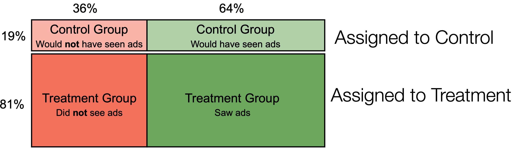

```{r setup, echo=FALSE, message=FALSE, include=FALSE}
library(latex2exp)
library(tidyverse)
library(ggplot2)
library(patchwork)
library(data.table)

berkeley_blue   <- '#003262'
california_gold <- '#FDB515'

options(htmltools.dir.version = FALSE)
knitr::opts_chunk$set(echo = TRUE, dpi = 300, fig.height = 3)


theme_set(theme_minimal())
```

class: inverse, center, middle 

#Introduction to Noncompliance

---
#Introduction

## Noncompliance in randomized experiments

- Sometimes units assigned to treatment do not actually receive treatment 
- This week, we will learn how to deal with noncompliance
  - How to analyze data correctly without inducing bias
  - How to design experiments to improve precision in the presence of noncompliance
- Leading example: Advertising experiments from earlier in the course
  - Randomly assign a person to be targeted with advertising
  - But, they don't browse to the site and so *choose* to receive zero ads
  - Or, some other advertiser non-randomly targets the person so our ad campaign cannot reach them. 

---
# Reading

## *Gerber and Green*: Chapter 5, Introduction

- This is about 4 pages of reading. 

---

class: inverse, center, middle

# Example: Get Out To Vote

---

# Introduction to Chapter 5

## Get out the vote (GOTV) example

- Treatment assigned at random
  - Canvasser knock on the doors of 1,000 treatment houses
  - Canvassers skip knocking on the doors of 1,000 control houses
  
## In the treatment Group
  - 250 subjects answer the door
  - The other 750 subjects did not receive treatment, *even though they were assigned to*. 
  
## Three groups of individuals 

With three groups of individuals, who should we compare to whom when estimating the treatment effect? 

1. **Group A**: 250 people who answered the doors? 
2. **Group B**: 750 people who didn't answer their doors? 
3. **Group C**: 1,000 people in the control group (on whose doors no one knocked)

---

# Introduction to Chapter 5 (cont'd) 

## *Field Experiments* considers three options: 

1. Compare group *A* to *C*: treatment individuals vs. control individuals 
2. Compare group *A* to groups *B* and *C* :treated individuals vs. untreated individuals 
3. Compare group *A* and *B* to group *C*: whol treatment group to whole control group

---

class: inverse, center, middle

# Example: Yahoo! Ad-Effectiveness 

---

# Yahoo! Ad Experiemnt 

## Group A 
- Assigned to treatment and received treatment 
- 64% of the treatment group 
- Purchased $1.81 per person 

## Group B 
- Assigned to treatment, *but did not receive* treatment 
- 36% of the treatment group 
- Purchased $2.04 per person 

## Group C 
- Assigned to control, *but did not receive* treatment 
- 100% of the control group
- Purchased $1.84 per person 

---

# Yahoo! Ad Experiemnt (cont'd) 

- The correct apples to apples comparison is \{*A* & *B*\} to *C*
- Treatment effect of $$\{(\$1.81 \times 0.64) + (\$2.04 \times 0.36) \} - \$1.84 = \mathbf{\$0.05}$$

## But, what is this effect? 

- Treatment effect is *diluted* but the 36% of consumers in the treatment group who did not receive ads and therefore could not have had any treatment effect
- This $0.04 estimate is called the **intent-to-treat (ITT)** treatment effect 
- The treatment effect on those who were *actually* treated must have been larger than $0.05
- Producing an unbiased estimate of the treatment effect on those actually treated requires *reweighing this ITT*. 

---

# Reading 

## Read *Field Experiments*, Section 5.1
- Section 5.1 introduces new notation about treatment since assignment to treatmetn no longer guarantees that a subject will (or did) receive treatment 
- As before, $d = 1$ indicates that someone received a dose of treatment, and $d = 0$ indicates that someone received a dose of control 
- Section 5.1 introduces new notation, $z$, that indicates whether someone was assigned ("azzigned" mnemonically) to treatment 

## Assignment and receiving treatment are distinct events 
- Someone might be assigned to treatment, $z=1$, but choose to take a dose of control, $d=0$
- In the future, we'll let subjects be assigned to control, $z=0$, but choose to take a dose of treatment, $d=1$

---

class: inverse, center, middle 

# Example: Blood Pressure

---

# Example: Blood Pressure

## Suppose our goal is to assess the effect of a new blood pressure medicine
  - 100 control individuals are giving nothing, $z=0$
  - 100 treatment individuals are provided with blood pressure medicine 
    - 60 individuals take their pills, $z=1, d=1$
    - 40 individuals do not take their pills, $z=1, d=0$

## Who are the compliers, and who are the never takers?     

---

# Example: Blood Pressure (cont'd) 

- 100 control group units did not take the pill, $z=0, d=0$, and have a **mean BP = 140**
- 60 compliers who took the pill, $z=1, d=1$, have a **mean BP = 150**. 
- 40 never-takers who did not take the pill, $z=1, d=0$, have a **mean BP of 100**

## Don't be tempted! 

- Tempting to naïvely conclude that pills increase blood pressure
  - People who take the pill have higher blood pressure than either of the groups that did not take the pill
- But, a more careful analysis would show that the ATE is, in fact, a *reduction* in blood pressure

---

# Reading: Skip *FE*, Section 5.2

## Key Takeaway #1 

- The **ITT** is the "intent-to-treat" effect 
  - The ITT is the difference of the average outcomes in the group assigned to receive treatment and the group assigned to receive control 
  - The $ITT = E[Y|Z=1] - E[Y|Z=0]$
  - This is a correct, *apples-to-apples* comparison 
  - But, this estimate will be diluted compared to the actual treatment effect for the people who received the treatment 
  - In other words, the ITT is the treatment effect of the *intention to treat*, $z$, on the outcome variable $Y$. 
  
---

# Reading: Skip *FE*, Section 5.2

## Key Takeaway #2

- The $ITT_{D}$ is the effect of being assigned to treatment, on *receiving a dose of treatment* 
- Because receiving a dose happens **after** random treatment assignment, it meets all the requirements of a causal effect
- $ITT_{D} = E[d_{i} | z_{i} = 1] - E[d_{i} | z_{i} = 0]$ 

## Blood Pressure Example 
- 60% of the treatment group received treatment, $E[d_{i} | z_{i} = 1] = 0.6$
- 0% of the control group received the treatment, $E[d_{i} |z_{i} = 0] = 0.0$. 
- And so, $ITT_{D} = E[d_{i} | z_{i} = 1] - E[d_{i} | z_{i} = 0] = 0.6 - 0.0 = \mathbf{0.6}$

## Alternative Terms 

- *Take up rate* 
- Or, alternative symbol, $\alpha$

---

# Reading: *FE*, Section 5.3

## Read *Field Experiments*, Section 5.3
- Gerber and Green draw an important distinction between the ATE and the CACE in this section 
  - The ATE is the average treatment effect for the whole population
  - The CACE is the average treatment effect for the population who comply with their assignment 
- When there is non-compliance, we cannot measure the potential outcomes to treatmetn for non-compliers -- none of them receive treatment! 
- Thus, when there is non-compliance, there is no guarantee that the ATE = CACE. 

---

class: inverse, center, middle 

# Example: Computing the CACE for Yahoo!

---

# Context for Causal Effects

## Context shapes which which quantity is more important to estimate 

- The *ATE* for everyone; 
- The *CACE* for the people we can actually treat 

- In advertising, the advertiser only pays for ads that were delivered to compliers 
- When computing the rate of return to advertising, all we care about is the cost of the ads and marginal increase in sales for people who received the ads

---

# Context for Causal Effects (cont'd) 

## Advertising 
- How much **more** would never takers purchase if we had given them ads? 
- An advertising team might want to know, but cannot *possibly* learn this because they cannot actually reach them! 
- (A targeting team; or product team might change its product to reach these previously unreachable leads)

## Other Examples
- GOTV canvassing 
- Job-training programs 
- Blood pressure drug trials 

- If people will not take the treatment they are assigned, what should we try to do to reach them? 
- If we cannot reach them, why do we care about the effect if we *could* reach them?

---

# Example: Advertising Effectiveness

- 36% of the treatment group did not receive any ads 



- The un-exposable 36% of never-takers do not produce any treatment effect, *because they do not receive treatment*. 
- Include them in estimate to maintain an apples-to-apples comparison

---

# Computing CACE for Yahoo!

- $ITT = \$0.05$, difference between treatment and control, including never-takers 
- $\alpha = ITT_{D} = 0.64$, the fraction of compliers that were reached with ads 
- If the exclusion restriction is true, never takers should have zero treatment effect
- $\therefore$, any treatment effect is generated from the 64% who received ads 
- To estimate treatment, divite the $ITT$ by the compliance rate 

$$CACE = \frac{ITT}{\alpha} = \$0.08$$

---

# CACE Standard Errors 

- In the Yahoo! example, we estimate an ITT of $\$0.05\pm\$0.07 = (\$0.02, \$0.12)$
- Among the people who complied with their assignment, their *CACE* is larger, $\$0.08$. Is this *now* statistically significant? Is the confidence interval $\$0.08\pm\$0.07$? 
- No! Equation 5.29 points out that scaling up our estimate also means scaling up our uncertainty? 
- We estimate a $CACE = \$0.08 \pm \$0.11$ and still have a non-significant result 
- Equation 5.29 provides this statement of CACE standard errors

---

# (Optional) Footnote 5.4 

- We do not actually know $\alpha = 0.64$ with certainty; this is, 
- $\alpha$ is, itself a statistic with sampling variation
- Estimating $CACE = \frac{ITT}{\alpha}$ will introduce some bias in samples if $\alpha$ is estimated with uncertainty
- Bias has the *opposite* sign as the correlation between $ITT$ and $\alpha$
- But, it is hard to know what the sign of this correlation is! 
- With large samples, $\alpha$ is estimated without much sampling variability, and $\displaystyle\lim_{n\to \infty} \widehat{CACE} \overset{p} \rightarrow CACE$. 

---

# Reading 

## Read *Field Experiments*, Section 5.9

## But First! 

- Think about the advertising-effectivenes example: 
  - 36% of subjects in that experiment are never-takers that cannot provide information about a treatment effect 
  - But, we cannot exclude them, because we cannot identify who, in the control group, *would have been* a non-complier if they were in treatment.
- Section 5.9 introduces the **placebo design** that distinguishes between subject *types* in without giving treatment to them.
- As a result, it is possible to exlcude never-takers from the CACE estimate *while still* maintaining an apples-to-apples comparison

## Two-Stage Least Squares 

- The acronym **2SLS** stands for two-stage least squares
- Don't worry too much about equations 5.30 and 5.31

---

# Applying a Placebo Design 

- Canvassing example shows that using a placebo to identify individuals in the *control group* would could receive treatment (i.e. they are compliers) can increase *efficiency*
- Apply this concept ot the Yahoo! example 
  - Yahoo! ad effectiveness experiment randomly assigned 80% of the population to be in the treatment group
  - Of those, 64% that were targeted for treatment actually received it
  - If we could find the 36% in the control group that *would not have taken treatment*, then we could exclude them and increase the precision of our estimates 
  
## Think for a moment

- What was placebo in the canvassing example? 
- How could one make a similar placebo in the Yahoo! example?

---

# Applying a Placebo Design (cont'd)

## Run placebo ads! 

In the control group, run an ad on an unrelated topic -- maybe the American Red Cross -- to the control group

## Johnson, Lewis and Reiley (2016) 

- JLR (2016) use this idea for a follow-up experiment on advertising effectiveness 
- Run placebo ads ("Do your searches on Yahoo!") to the control group with *exactly* the same campaign parameters as the treatment campaign for the retail store
- Added benefit: **Two advertising experiments for the price of one!**
- By making the placebo campaign exactly mirror the treatment campaign, guaranteed that those receiving ads would be *exactly* the same population of compliers in treatment and control

---

class: inverse, center, middle

# Benefits of a Placebo Design

---

# Benefits of a Placebo Design

- With a treatment-placebo or treatment-control design we produce an unbiased estimate of the CACE
- **Treatment-Placebo Design**
  - Compare complier in treatment to compliers in control. 
  - Directly compute the *average treatment effect on the treated* individuals (sometimes, called the "ATET")
- **Treatment-Control Design** 
  - Compute the ITT over all subjects 
  - Compute $CACE = \frac{ITT}{\alpha}$, scaling up the estimate, but also the errors from the estimate 
- The placebo design does not change the estimated treatment effect, ATET and CACE are unbiased estimates of the same quantity  

## Placebo design produces precision $\rightarrow$ **Power**

---

# How Much Benefit for Placebo Design?

## How much does the placebo design shrink standard errors? 

- Suppose $\sigma_{t}^{2}$ and $\sigma_{u}^{2}$ represent the variances of $Y$ for compliers and never-takers respectively
- The index in $t$ and $u$ are for *treated* and *untreated* individuals respectively.

$$\frac{V[\tau_{CACE}]}{V[\tau_{ATET}]} = 1 + \frac{\left(\frac{\sigma_{t}^{2}}{\sigma_{u}^{2}}\right) \times (1 + \alpha)}{\alpha}$$

- So long as the variance of $Y$ for the never-takers and compliers are approximately equal, this converges in probability to 

$$\frac{V[\tau_{CACE}]}{V[\tau_{ATET}]} = \frac{1}{\alpha}$$
---

# How Much Benefit for Placebo Design?

- The standard error from using a treatment-control design will be larger than the standard error from a placebo design by a factor of $\frac{1}{\sqrt{\alpha}}$
- The take-up rate, $\alpha$ is always between $[0,1]$, so this variance inflation rate will always be larger than $1$.
  - If the take-up rate is only $1\%$, then a placebo-design will shrink standard errors by a factor of ten
  - If the take up rate is $25\%$, a placebo design will shrink standard errors by a factor of two
  - If the take up rate is $90\%$, a placebo design will shrink standard errors by only five percent
  
---

# Technology to Apply Placebo 

## Johnson, Lewis, Nubbemeyer (2017): **Ghost Ads**!
- With a correctly designed server, it is not necessary to pay for placebo ads to get a placebo design 
- Instead, log the counterfactual ad impressions that would have occurred in the control group

---

# Ghost Ads 

## Ghost Ads at Pandora 

- Suppose that Pandora is ready to serve an audio ad; and that the marketplace clears a *Home Depot* ad. 
- If that user has been assigned to the control group, the system instead plays the second-highest bidding ad in the marketplace. Suppose this is for a Toyota truck. 
  - (This example really lands home with Alex while he's making the slides...) 
- The user *hears* a Toyota ad that has be *posessed* (spooky!) by a Home Depot ghost ad.
- In practice, the key is to log the fact that the listener *would have* received a Home Depot ad if they were in the control group
- So long as the server is set up correctly, and doesn't change any *other* features of the ad, the group no longer has to pay for American Red Cross placebo ads

---

# Ghost Ads: Lower Cost, Moar Precision

## Ghost ads produce a more accurate counterfactual

- In a real Home Depot campaign, sometimes the treatment ad will displace a competitors ad (Lowe's?) 
- With a placebo ad, a control group would not get the placebo Red Cross ad, but instead the Lowe's ad. 
- *This doesn't match with the ideal of either the treatment-control or treatment-placebo design*. 
- Perhaps this is a small effect, but it is still better to give the listener exactly the ad that they would have received in the absence of the campaign

---

# More Neat Technology 

## Smart pill bottles 

- Return to the blood pressure case
  - Suppose you give placebo (sugar) pills to the control group and everybody has a bottle that is wirelessly connected to a recording computer
  - The chip transmits information to the researcher to record every time the bottle has been opened
  - The researcher knows exactly who has and has not opened the bottle (is this the same as taking the pill?) and who has not 
- Implemented correctly, this study can now discard the data from never-takers, and produce a more efficient estimate from the compliers  

---

class: inverse, center, middle

# What Can Go Wrong with Placebos?

---

# Did the placebo work as required?

## Is the take-up rate the same in treatment and control?

- Do we see covariate balance between compliers in treatment and control? 
- A (bad) idea: save money on placebo ads by putting a frequency cap on the placebo campaign. 
  - Each individual hears at most one placebo ad. 
  - Money saving, since we're not subsidizing an advertising campaign for the Red Cross (they're a great organization!) 
  - What could go wrong? 
- When we conduct this experiment, what if we learn that the take-up rate was different in control than treatment?
- *For example*: suppose we observe that $60\%$ of the treatment group receives treatment ads; and $82\%$ of placebo receive placebo ads
  - Covariates show that compliers in treatment browse more than compliers in placebo
  - **Biased estimate!**
  
---

# What *else* could go wrong? 

- What if the placebo has a treatment effect on the outcome we're interested in? This would be an **eclusion restriction** violation

## Examples

- Play Red Cross ads to the control group of a Home Depot advertising campaign. **We're probably in the clear.** 
- But, what if we had played Habitat for Humanity? Might people go purchase supplies when they were preparing to volunteer? 

---

class: inverse, center, middle 

# Two-Sided Noncompliance

---

# Reading 

## Read *Field Experiments*, Introduction to Chapter 6 and section 6.1 

## Reading Tips

- Be certain to read box 6.1; it provides concepts and notation for this section 
- Remember that wehn we are using binary variables, we can multiply them to get a boolean $AND$. 

$$\pi_{c} \equiv \frac{1}{N}\sum_{i=1}^{N}d_{i}(1)(1-d_{i}(0))$$

- $d_{i}(1) = 1$ if, when assigned to treatment, the individual receives the treatment 
- $d_{i}(0) = 0$ if, when assigned to control, the individual receives control
- If $d_{i}(1)(1-d_{i}(0)) = 1$ then the person is a complier

---

# Two-sided Noncompliance

- One-sided noncompliance occurs when treatment units receive control, but all control units correctly receive control
- If control-group subjects can get treated, then we must consider four types of individuals 

1. **Compliers** who do exactly as they are told: 
  - $z=1 \rightarrow d=1$
  - $z=0 \rightarrow d=0$
2. **Never-takers** who never take the treatment, no matter their assignment. 
3. **Always-takers** who always receive the treatemnt, no matter their assignment.
4. **Defiers**, the 4 year-old kids of experiments, who do the opposite of what they are told: 
  - $z=1 \rightarrow d=0$
  - $z=0 \rightarrow d=1$

## Key assumption: No defiers
- Also known as *monotonicity assumption* the dosage is increasing in assignment
- Without this assumption, we cannot produce an estimator. Is this assumtpion ever violated?