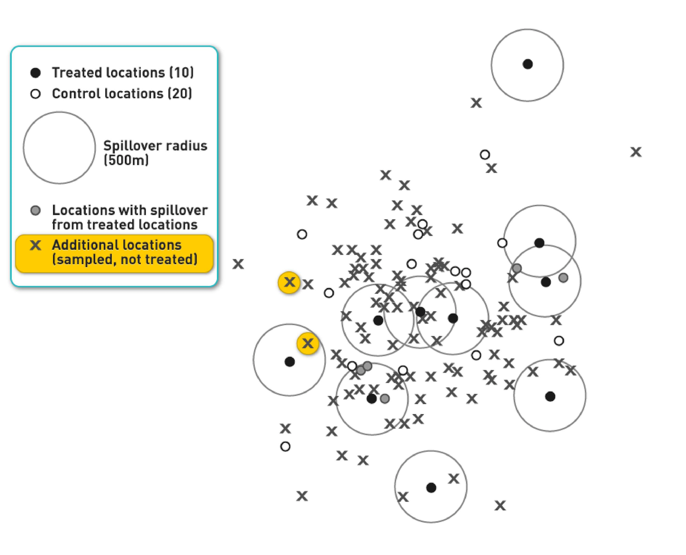

```{r setup, echo=FALSE, message=FALSE, include=FALSE}
library(latex2exp)
library(tidyverse)
library(ggplot2)
library(patchwork)
library(data.table)

berkeley_blue   <- '#003262'
california_gold <- '#FDB515'

options(htmltools.dir.version = FALSE)
knitr::opts_chunk$set(echo = TRUE, dpi = 300, fig.height = 3)


theme_set(theme_minimal())
```

class: inverse, center, middle 

# Waitlist Designs 

---

# Waitlist Design

## Main Topics

- Introduction
- Benefits
- ??

---

# Introduction to Waitlist Design

## Administer randomized treatment to all subjects over time
- Treatment administered to groups of subjects at different times
  - "Rolled out" over time
- Control group
- Alternative name: *Stepped-wedge* designs


---


It should be something like [this](https://www.google.com/url?sa=i&url=https%3A%2F%2Fwww.researchgate.net%2Ffigure%2FThe-quasi-experimental-stepped-wedge-intervention-design-allows-for-repeated-measures-at_fig4_282047267&psig=AOvVaw0s6o1LlG56zdNp-K5WQtLv&ust=1624287570683000&source=images&cd=vfe&ved=0CAoQjRxqFwoTCIiOifC8pvECFQAAAAAdAAAAABAJ)

or like [this, maybe?](https://www.google.com/url?sa=i&url=https%3A%2F%2Fwww.researchgate.net%2Ffigure%2FTrial-Diagram-of-a-possible-stepped-wedge-design_fig1_303827298&psig=AOvVaw0s6o1LlG56zdNp-K5WQtLv&ust=1624287570683000&source=images&cd=vfe&ved=0CAoQjRxqFwoTCIiOifC8pvECFQAAAAAdAAAAABAO)

---

# Benefits of Waitlist Design

- Allows experimentation 
- Allays concerns about witholding treatment
- Can see effects in early treatment groups before administering to all groups
- Long-run *and* simultaneous treatment effects

---

# Main takeaways

## *Ceteris paribus*
"all other things being equal" except treatment effect

## Spillovers between subjects can bias results
- Positive spillovers: underestimation
- Negative spillovers: overestimation
- Clustered treatment can eliminate this bias

Within-subjects design can be valuable if treatment effects are limited in time
- We will learn more about this soon

Stepped-wedge designs get variation both within and between subjects


---

# Reading Assignment

## *Field Experiments* 
Section 8.5 on waitlist designs
First three paragraphs

*note that the example in the rest of this section is instructive if you wish to read it, but the details are beyond our scope*

---

class: inverse, center, middle 

# Within-Subjects Designs


---
**_Should I have an intro "This is what we will cover this week" slide here?_**

# Potential problems

- Benefits of randomization lost
  - Independence from other factors that might cause outcome
  - impossible to predict in advance what other events might influence outcome
- Ample permutation space for statistical inference
  - Best attainable *p*-value is 0.5
  
Including many time periods can solve this problem
- Room for randomization
- Enough data for valid standard-error estimates

---


class: inverse, center, middle 

# Time Spillover

---

# Longer-Term Effects of Advertising

Lewis and Reiley (2014) estimate persistent effects of advertising in subsequent weeks

Without re-reandomization in second campaigns, we can't distinguish its separate effects

---
# <ins>OJO</ins>!


- Treatment point estimates uniformly positive every week
- DID assumption may have caused overestimation
  - Same pre-period
  - Overestimation due to pre-period differences will carry over to all subseguent weeks
  
- Results show evidence of long-term effects of advertising

---

#Reading Assignment

## **Field Experiments, Section 8.4**
Temporal spillover effects over time, from present to future
Within-subjects experimental designs

---

class: inverse, center, middle 

# Spacial Spillover


---

# Example of spillover in two dimensions




---
# Assumptions

## Assumptions about geographic extent of spillover can radically change estimates
- Eg. 750 m vs 500 m
- What if not constant?
  - Linear decline
  - Quadradic decline

Contrast with usual virtue of experiments: make measurements with minimal assumptions

Assumption problems not unique to geography
- Eg. social networks

---
# Reading

## *Lewis and Reiley (2014)*, Section 4
Access this paper here

## OJO NO LINK PRESENT


---

## Data analysis with non-experimental control
- Multiple comparisons problem: Fishing expeditions can cause overstatement of true statistical significance.

---

# Reading 

## Reading: *Field Experiments* 
Please read

- Section 9.0 (the Introduction), and, 
- Section 9.1 

---

class: inverse, center, middle 

# Motivating Examples of Heterogeneous Treatment Effects 

---

# Quiz Question Discussion

- Potential outcomes are hypothetical population parameters.
- In real-world samples, we get to measure only
  - Treatment outcomes for the treatment group
  - Control outcomes for the control group
- We can measure only treatment outcomes or control outcomes for a single person.

---

# Reading 

## Reading: *Field Experiments*, Section 9.3.1

While reading, consider, "Do different groups have different treatment effects?"

---

# Example: Electricity Consumption

## Test Groups
1. Below-average; and, 
2. Above-average electricity consumers

## Treatment 
- Social comparison
- How much electricity are your neighbors using? 

## HTE
- Are people who use a *lot* of energy more responsive than people who aren't using much energy? 
- Are people who are using less than their neighbors going to start using more? 

---

# Example: Congressional Responsiveness

## Test groups
1. Members of Congress from the North; and, 
2. Members of Contress from the South

## Treatment 
- Being informed of a meeting with a donor versus a constituent

## HTE
- Responsiveness of different congressmen

---

# Example: eBay Shipping Policies 

## Test groups 
- Buyers of high-priced items 
- Buyers of low-priced items

## Treatment
- Charging (or not charging) a shipping price on an auction
Some measure of value should be predetermined before the experiment

## HTE
- Responsiveness to shipping costs on high-value versus low-value items

---

# Example: eBay Seller Reputation

## Test Groups 
- Buyers of high-priced items 
- Buyers of low-priced items

## Treatment 
- Selling from a high- or low-reputation account 

## HTE
- Are people differently reactive to reputation when they are buying high-priced, rather than low-priced items? 

---

# Example: Donation Matching 

## Test Groups 
- People who live in *Blue States* 
- Peolpe who live in *Red States* 

## Treatment 
- Informing individuals that a donation they make to the ACLU will be matched 

## HTE 
- Because the ACLU is perceived to be a "Liberal" non-profit organization, do individuals who live in areas that are more liberal react more strongly to the donor-matching treatment? 

---

class: inverse, center, middle 

# Treatment-by-Covariate Interactions 

---

# Quiz Review 

## Answer
- Students whose parents' literacy was above the median

## Discussion 
- Treatment effect not statistically significantly different between students whose parents have above-median versus below-median literacy
- We need to know standard errors in order to evaluate how much to believe a point estimate

---

# Estimating HTEs

## Etimating with two samples 

- Split data into two separate samples
- Compute means and standard errors of the treatment effect in each group
  - Do a two-sample test of means.
  - **Group one**: Students whose parents have above-median literacy
  - **Group two**: Students whose parents have below-median literacy
  
---

# Estimating HTEs (cont'd) 

## Estimating with regression 
- Estimate a regression with dummy variables 
  - $I$ indicator for teacher incentive treatment 
  - $P$ indicator for parents with above-average literacy 
- Include an interaction between $I \times P$

$$Y_{i} = \beta_{0} + \beta_{1} I_{i} + \beta_{2} P_{i} + \beta_{3} (I_{i} \times P_{i}) + \epsilon_{i}$$
## Inferences 
- Test whether there is evidence that the interaction term is different from zero
  - $H_{0}$: The treatment effects are no different between the groups 
  - $H_{A}$: The treatment effects are different between the groups

---

# Reading Clarification 

- Always present standard errors with point estimates.
- Always show the number of observations.
- Reports the coefficient on one row, and the standard error in parentheses on the row below
- Includes a reporting of: 
  - The number of observations
  - The $R^2$ and *F-Test* vs. an intercept-only model

---

class: center

## Standard Format of Results 

```{r, echo = FALSE}
d <- data.frame(x = runif(n = 100, min = 0, max = 10))
d$y <- 1 + d$x + rnorm(n = 100)

model <- lm(y ~ x, data = d)

stargazer::stargazer(
  model, type = 'text',
  covariate.labels = 'Treatment', 
  dep.var.labels = 'Score', 
  omit.stat = c('ser'), 
  digits = 2)
```

---

# Reading Clarification (cont'd) 

$$\widehat{Y}_{i} = \beta_{0} + \beta_{1} I_{i} + \beta_{2} P_{i} + \beta_{3} (I_{i} \times P_{i})$$

- If a test for $\beta_{3}$ rejects the null hypothesis, then treatment effects differ along with levels of the covariate
- Possible to estimate this with regression or randomization inference 
  - Gerber and Green use randomization inference, 
  - With data that is well-behaved, we can rely on the Central Limit Theorem and use regression
  
---

class: inverse, center, middle 

# Teacher Incentives: Evidence from India

---

# Example: Teacher Incentives 

## [Muralidharan and Sundararaman (2011)](https://www.jstor.org/stable/10.1086/659655)


---

# School Enrollments 


---

# Data Structure: Teacher Gender 

| Test Score | Male Teacher | Incentive | Interaction | 
|------------|--------------|-----------|-------------|
| 10         | 1            | 1         | 1           |
| 12         | 1            | 0         | 0           | 
| 8          | 0            | 1         | 0           | 
| 14         | 0            | 0         | 0           | 

---

# Results: Teacher Gender 


---

# Estimating Equation 

$$\begin{aligned} 
  T_{ijkm}(Y_{n})  = \alpha &+ \gamma T_{ijkm}(Y_{0}) + \delta_{1} Incentives_{i} \\ 
    & + \delta_{2} Characteristic_{i} \\ 
    & + \delta_{3} (Incentives_{i} \times Characteristic_{i}) \\ 
    & + \beta Z_{m} + \epsilon_{k} + \epsilon_{jk} + \epsilon_{ijk}
\end{aligned}$$

- $T$ is a test score taken in year Y 
- $Z_{m}$ are covariates that are used to increase efficiency of the estimate
- Subscripts are: 
  - $i$ indexes the student, $j$ the grade, and $k$ the school, and $m$ mandal
  - $n$ year of observation
  
## Regressors of interest 

- Incentives 
- Characteristics

---

# Reading Regression Results 

- Each column represents a separate regression estimate
  - **Dependent Variable**: Students' test score after treatment, normalized by the standard deviation across students
  


- If a male student started at the 50th percentile, the treatment would have increased him to the 59th percentile.
- No compelling evidence that treatment works differently for male or female identifying students - no HTE

---

class: inverse, center, middle 

# HTEs by Student Characteristics

---

# Quiz Review 

- Asterisks help reader pick out statistically significant effects
- Most columns had statistically significant treatment effects...
- ... but no statistically significant HTEs

---

# Household Wealth Interaction Effect

- Only the household affluence interaction term was statistically significant.
- Household affluence variable is difficult to interpret.
  - Interaction coefficient = `0.038 **`
  - Treatment effect increases by 0.038 for each additional point of household-affluence score.
  - *Household-affluence score* ranges from 0–7
  - Assumes all categories have equal treatment-effect benefits -- $1 \rightarrow 2 = 6 \rightarrow 7$
  
---

# Alternative Specification 

## Rather than a linear scale, allow multiple dimensions of wealth 

- Seven separate dummy variables as covariates.
  - One for owning land
  - One for owning a house
  - One for having running water
  - One for owning a TV
- And then, seven different interaction terms.

---

# One Regression to Rule Them All? 
## Several specific regressions or one big regression?

- Muralidharan and Sundararaman (2011) Used one column for each covariate
  - Each covariate could have been put into the same regression.
  - But, might be difficult to identify *each* effect, since covariates are not randomly-assigned 
  - As a result, many of the covariates might covary with others, and so lead to "unstable" estimates 
  - This instability is because one measure is picking up many, related effects

## Colinearity isn't a problem with treatment variables 

- Because the experiment has randomly assigned treatment, it should be independent from all sets of covariates

---

# Teacher Incentives: Household Affluence 


- Adding household affluence leads the reported effect on `Incentive` to shrink
  - Estimated overall ATE = $3.5$ (average affluence) $\times 0.038 = 0.133$ 
  - (Note, this would only be the case if there was a uniform distribution, or symmetric distribution across the affluence scale)
  - Incentive + estimated overall ATE $0.09 + 0.133 = 0.223$
- In an interaction model, the effect of treatment depends on levels for interacted variables  

---

# Teacher Incentives: Parental Literacy


- Always be aware of the amount of statistical uncertainty in estimates
  - Confidence interval: $−0.003 \pm 0.038$ per unit of literacy
  - The largest absolute value in that interval is $-0.003 - 0.038 = -0.041$.
- Even using the coefficient estimate with the largest magnitude $-0.041$ and evaluating it at the largest parental literacy value, $4$, the estimated total interaction effect confidence interval is $-0.041 \times 4 = -0.16$
- This is still smaller than the baseline treatment effect, $0.224$ for those with totally parents marked as a zero on literacy

---
class: center, middle

## Always look at the magnitude of the estimate! 
## Always look at size of the confidence interval!

---

# Broad based Treatment Effect 


---

class: inverse, center, middle

# HTEs by Teacher Characteristics

--- 

# Review: Student Characteristic HTE

- Broad-based benefits from teacher incentive program were found.
  - No HTEs by past student test score
  - Household wealth was the only significant HTE interaction.
  
---

# Teacher Characteristics

Review the table.
Answer the quiz questions.